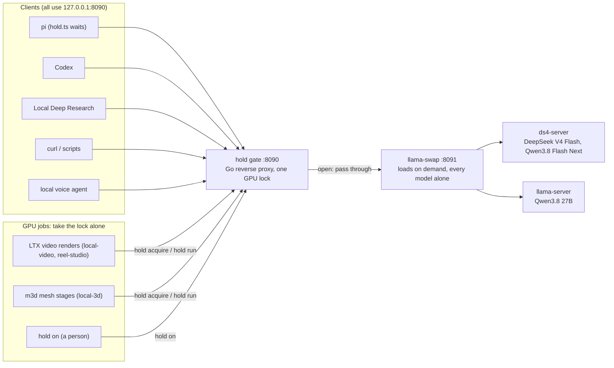
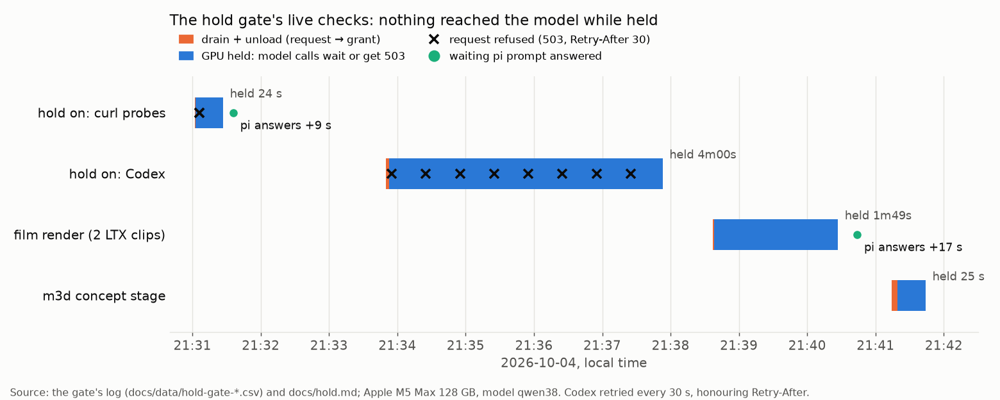
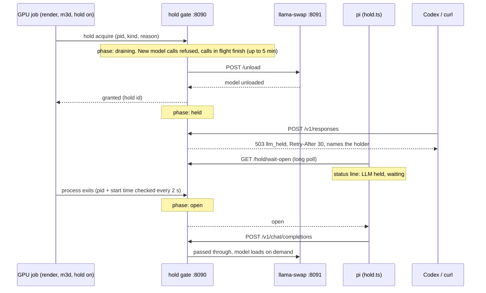
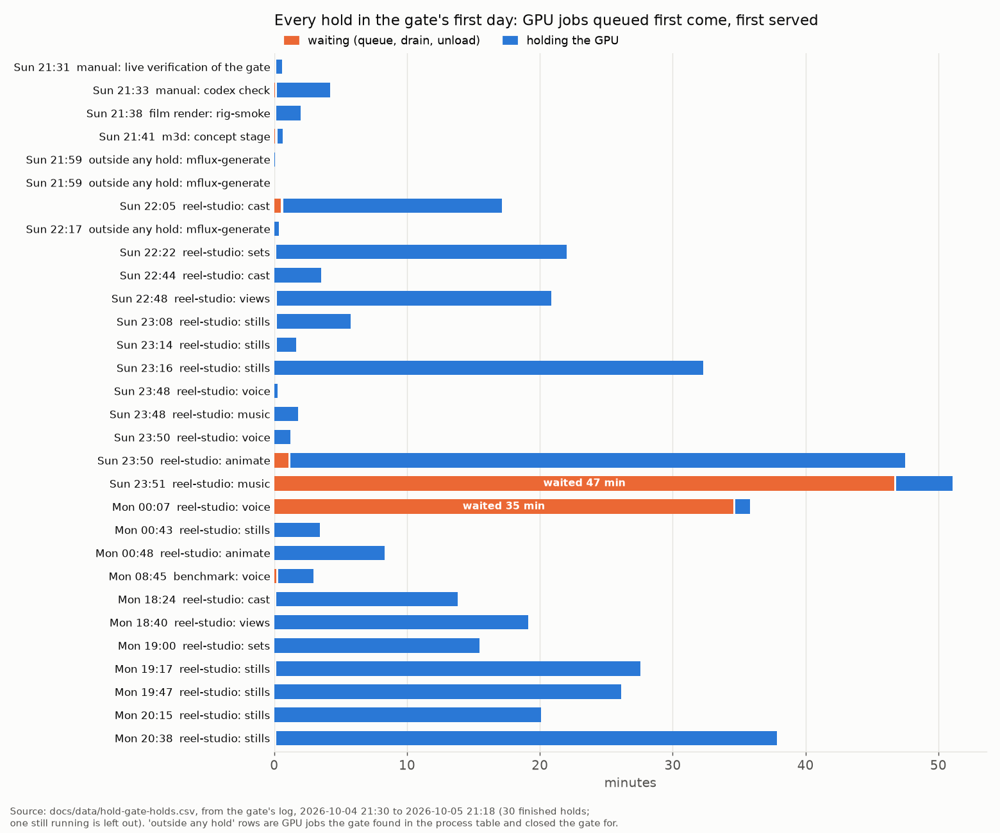
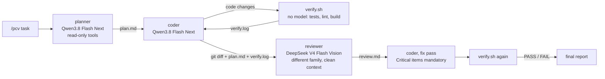

# local-rig

**One OpenAI-compatible endpoint for every local model on a 128 GB Mac, a GPU lock that keeps the LLM from
reloading into a video render, and a serial plan → code → verify → review → fix agent loop on top.**


*A real session, replayed: on 2026-10-05 at 21:42 a [reel-studio](https://github.com/mthomas100/reel-studio)
render held the GPU. A request that would have loaded an 80 GiB model got a 503 naming the holder, and nothing was
loaded. Captured output: [docs/data/live-held-session-2026-10-05.txt](docs/data/live-held-session-2026-10-05.txt);
SVG drawn by [make_terminal_svg.py](docs/charts/make_terminal_svg.py), no text reworded.*

`local-rig` runs a Mac's local models behind [llama-swap](https://github.com/mostlygeek/llama-swap): DeepSeek V4
Flash and Qwen3.8 Flash Next on [ds4](https://github.com/antirez/ds4)'s `ds4-server`, other Qwen models on
llama.cpp's `llama-server`. llama-swap loads whichever model a request names and evicts the one that was there. On
this machine that is a hard rule, not a preference: no two of these models fit in memory together. In front of
llama-swap sits **the hold gate**, a small Go reverse proxy with one lock. A video render, a 3D-mesh job or a person
can take the GPU; the gate drains the calls in flight, unloads the model and refuses anything that would load it
again until the hold ends. pi sessions wait politely and carry on afterwards. Everything else (Codex, curl,
research tools) gets a 503 that names who holds the GPU. On top, a pi prompt runs a **serial multi-agent loop**:
planner, coder, deterministic verifier, cross-family reviewer, coder again. Each stage is its own short-lived
process and every hand-off is a file, so only one model is ever needed at a time.

Built for and measured on an Apple M5 Max with 128 GB of unified memory, macOS 27.

## Contents

- [How it fits together](#how-it-fits-together)
- [The hold gate](#the-hold-gate)
- [The /pcv loop](#the-pcv-loop)
- [One model registry, generated configs](#one-model-registry-generated-configs)
- [Hard-won rules](#hard-won-rules)
- [Requirements](#requirements) · [Setup](#setup) · [Usage](#usage) · [Tests](#tests)
- [Status and limitations](#status-and-limitations) · [Related repos](#related-repos) · [Credits and licences](#credits-and-licences)

## How it fits together



| Piece | What it is | Where |
|---|---|---|
| Hold gate | Go proxy and CLI (`hold`), unit tests, end-to-end test with real pi | [`hold/`](hold/), [docs/hold.md](docs/hold.md) |
| pi side of the gate | waits before every model call while the GPU is held | [`extensions/hold.ts`](extensions/hold.ts) |
| llama-swap config | generated from the model registry, never hand-edited | [`tools/gen-swap-config.sh`](tools/gen-swap-config.sh) |
| Agent catalogs | pi, Oh My Pi and Codex model lists from the same registry | [`tools/gen-pi-models.py`](tools/gen-pi-models.py) |
| /pcv loop | three role files and one prompt for pi's subagent extension | [`agents/`](agents/), [`prompts/pcv.md`](prompts/pcv.md) |
| Verifier | runs the project's own tests, lint and build; no model | [`tools/verify.sh`](tools/verify.sh) |
| launchd jobs | templates for the gate, llama-swap and the optional web services | [`launchd/`](launchd/), [`tools/install-launchd.sh`](tools/install-launchd.sh) |
| Web research (optional) | self-hosted SearXNG, pi-web-access, Local Deep Research | [docs/web-research.md](docs/web-research.md) |

## The hold gate

**The problem.** A loaded LLM wires about 80 GiB on this Mac. An LTX-2 video render, an image model or a 3D-mesh
stage needs most of the same memory, and an LLM prompted beside a render slowed it about 9x (measured with the film
rig, 2026-09-23). The earlier guard was a pi hook that paused pi while a render process existed. It knew nothing of
3D jobs, it started only once the render process existed (a busy session could reload the model in the gap after
the unload), and it bound pi alone: Codex, research tools and curl went straight to llama-swap, which loads whatever
it is asked for.

**The rule** (2026-10-04): when the LLM is held off on purpose, nothing may bring it back, whatever the client and
whatever the reason. A request made meanwhile waits (pi) or is refused without touching the model (everything
else). A request made while the model is loaded uses it instead of swapping it.

**The design.** One lock, enforced at the one address every client already used. The gate moved onto llama-swap's
old port and llama-swap moved behind it, so no client needed reconfiguring.



*The gate's first live checks, 2026-10-04, drawn from its own log ([data](docs/data/),
[script](docs/charts/make_charts.py)). While the GPU was held, curl and Codex got 503s, a pi prompt waited instead
of failing, and llama-swap received no model requests.*



What makes it robust rather than just a lock:

- **A hold dies with its processes.** The gate records each holder's pid *and* start time and scans the process
  table every 2 s, so a crashed render cannot keep the LLM off, and a reused pid is not mistaken for the holder.
- **Holds queue first come, first served.** A second render waits its turn instead of being refused. In the first
  day of use two jobs waited 47 and 35 minutes behind a long animation render (chart below).
- **Nesting.** A process inside a granted hold (`HOLD_ID` in its environment, or an ancestor owns the hold) joins
  it: a queue runner, the story script it starts and the renderer under that are one hold.
- **GPU jobs that took no hold still close the gate.** A render started by hand, or an older script, is found in the
  process table by what program it runs (never by a word somewhere in its arguments). Long-running servers are
  left out on purpose: alive is not busy.
- **Nothing loads behind its back.** While held, the gate checks llama-swap now and then, and unloads a model that
  someone loaded by talking to :8091 directly.
- **Safe requests always pass.** `/running`, `/unload`, `GET /v1/models`, logs and the UI work while held. A
  `GET /upstream/<model>/logs` is *not* safe: on 2026-10-02 one started a model.
- **State survives a gate restart** (`~/.local/state/hold/state.json`); a reboot drops every hold.



*Every hold from the gate's log, 2026-10-04 21:30 to 2026-10-05 21:18 ([data](docs/data/hold-gate-holds.csv)).
The unload before a grant took 0.2 to 7.7 s ([data](docs/data/hold-gate-unloads.csv)). One caveat the log shows: at 22:05,
during a 31 s drain, eight pi calls were refused (they retried) rather than waiting. A pi session waits only once it
has loaded `hold.ts`; sessions already open when the gate went in need `/reload`.*

The CLI:

```
hold                         status: open / draining / held, by whom, what is in flight and waiting
hold on [--for 2h] "why"     hold the LLM off on purpose (waits for calls in flight, unloads, holds)
hold off [id]                end it
hold run [--kind K] [--reason R] -- <cmd...>   run a GPU job under a hold (exec: the hold ends with the job)
hold acquire --pid N --kind K --reason R [--json]   for programs; prints the id once granted
hold release <id>
hold wait [--timeout 10m]    block until model calls may pass
hold gate [--listen ...] [--upstream ...]           the gate itself (run by launchd)
```

Design notes, the full list of who waits and who is refused, and the way back are in [docs/hold.md](docs/hold.md).

## The /pcv loop

`/pcv <task>` in pi runs one subagent **chain**: four stages, one child `pi` process at a time, hand-offs through
files in the project. pi's subagent extension implements `chain` as an awaited loop, which is exactly the
one-model-at-a-time guarantee this machine needs; its parallel `tasks` mode is never used.



- **Plan and code are separate phases** even on the same model: the coder never sees the planner's conversation,
  only `plan.md`, which must name exact files, 5 to 8 steps and how to verify each.
- **The verifier is not a model.** [`tools/verify.sh`](tools/verify.sh) finds the project's own checks (a
  `.rig-verify` file, then Makefile, npm, Python, Cargo, Go or shell) and writes their output verbatim to
  `verify.log`. Exit 2, "no verifier found", is not a pass.
- **The reviewer is a different model family** with a clean context and read-only bash. It sees the diff, the plan
  and the verifier log, nothing else, and writes severity-tagged findings with file and line.
- **Each role is a markdown file** ([planner](agents/planner.md), [coder](agents/coder.md),
  [reviewer](agents/reviewer.md)) with its model in the frontmatter, so changing a role's model is a one-line edit.

**Measured end to end (2026-09-12).** `/pcv add a subtract(a, b) function to calc.py and a unit test for it` in a
scratch repo: planner → coder (ran verify.sh) → reviewer (PASS, no Critical items or warnings) → coder fix pass (no
changes needed). 370 s wall clock, two model swaps, never more than one child `pi` alive, correct code,
`verify.log` PASS. That run used the models of the time (a DeepSeek V4 Flash Q2 quant for plan and code, Qwen 27B
for review). Those rows have since been replaced by the pairing shown above, which has not been re-timed.

## One model registry, generated configs

Every model is one row in a registry: 11 pipe-separated fields (`target|engine|family|ctx|trust|dl|label|use|gguf|vision|drafter`)
plus optional launch arguments. On the author's Mac the registry lives in `ds4-serve`, a launcher script in a local
ds4 checkout; anywhere else, point `RIG_SPEC` at a file in the same format ([example](examples/registry.example)).
Two generators derive everything else from it, so there is never a second model list to drift:

- [`tools/gen-swap-config.sh`](tools/gen-swap-config.sh) writes `config/llama-swap.yaml`: commands per engine,
  health checks, unload timeouts, per-slot context windows and the router that keeps every model alone.
- [`tools/gen-pi-models.py`](tools/gen-pi-models.py) writes the model catalogs for pi, Oh My Pi and Codex, including
  each engine's thinking-level mapping and the context budget that leaves room for output.

The `trust` field is shown in every model picker and follows one convention: `verified N/M` only after N of M real
agent runs passed *through pi*, `untested` otherwise.

## Hard-won rules

Each of these is in the code with the date and measurement that put it there.

- **Never let llama-swap SIGKILL a model after 10 s.** Its default `unloadTimeout` is 10 s, then SIGKILL. On macOS a
  SIGKILL against a process holding a large wired Metal allocation can leak that memory until reboot (reported in
  [jundot/omlx#2184](https://github.com/jundot/omlx/issues/2184), [exo#1872](https://github.com/exo-explore/exo/issues/1872)
  and [exo#1972](https://github.com/exo-explore/exo/issues/1972), the last a kernel panic on an M4 Max 128 GB). The
  rig uses 180 s, and 240 s on ds4 models, whose loads take 13 to 17 s.
- **Budget against 107.52 GiB, not 128.** That is Metal's `max_recommended_working_set_size` on this machine (84 %
  of physical). Two models that answered when loaded by hand still ran out of memory at Metal warmup when
  llama-swap swapped into them, and the "zero swap" pair of a big model plus a lean worker died on a 5.2k-token
  tool prefill. So every model runs alone.
- **Verify through the agent, never curl.** A 67-token curl passed on a configuration that died on pi's real system
  prompt.
- **No `concurrencyLimit`.** Over the limit llama-swap answers 429 immediately rather than queueing, and a request
  orphaned by a killed client holds the slot for its whole generation. Both backends serialize internally anyway.
- **Scripted `pi -p` calls need `< /dev/null`**, or pi waits forever on an open non-TTY stdin.
- **Run llama-swap as an Interactive launchd job.** As a Background job, macOS throttled ds4's GPU keepalive loop
  about fourfold, and every voice-agent turn after a pause waited 1 to 4 s for its first token (2026-10-05).

## Requirements

- **Apple Silicon Mac** with enough unified memory for the models you register. Measured on an M5 Max with 128 GB
  and 40 GPU cores, macOS 27. The gate itself is tiny; the models are not (the example registry's GGUFs are
  18 to 165 GiB on disk; ds4 keeps part of the largest on SSD, and Qwen3.8 Flash Next wires about 80 GiB when loaded).
- [llama-swap](https://github.com/mostlygeek/llama-swap) (v255 tested), Homebrew-installed at `/opt/homebrew/bin`.
- At least one engine: [ds4](https://github.com/antirez/ds4)'s `ds4-server` and/or llama.cpp's `llama-server`, with
  GGUF weights. **Weights are not included.**
- **Go 1.24+** to build the gate (built with Go 1.27).
- [pi](https://github.com/earendil-works/pi) with its subagent example extension for `/pcv` (tested with pi 0.99);
  optional: Codex, Oh My Pi.
- Python 3 for the generators; [uv](https://docs.astral.sh/uv/) only to redraw the charts.

## Setup

```sh
git clone https://github.com/mthomas100/local-rig ~/repos/local-rig
cd ~/repos/local-rig
git config core.hooksPath hooks

# 1. describe your models (or use ds4-serve's registry via DS4_DIR)
cp examples/registry.example my-registry      # edit: your GGUF paths, contexts, trust
export RIG_SPEC=$PWD/my-registry DS4_DIR=~/repos/ds4   # DS4_DIR: where ds4-server, llama-server and gguf/ live

# 2. generate and check llama-swap's config
./tools/gen-swap-config.sh > config/llama-swap.yaml
llama-swap --config config/llama-swap.yaml -validate

# 3. build the gate (vet, unit tests, build) and put llama-swap behind it
hold/build.sh
hold/switch-over.sh check      # refuses if a GPU job runs or a model is loaded
hold/switch-over.sh in         # renders the launchd jobs, llama-swap on :8091, the gate on :8090

# 4. point the agents at it
./tools/gen-pi-models.py       # pi, Oh My Pi and Codex catalogs -> http://127.0.0.1:8090/v1
ln -s ~/repos/local-rig/agents/*.md ~/.pi/agent/agents/
ln -s ~/repos/local-rig/prompts/pcv.md ~/.pi/agent/prompts/
```

`hold/switch-over.sh out` is the way back: the gate leaves, llama-swap returns to :8090, and every client keeps
working. The launchd plists are templates (`__HOME__`, `__RIG__`); `tools/install-launchd.sh` renders them.

## Usage

```sh
curl -s 127.0.0.1:8090/v1/models | python3 -m json.tool    # the catalog
curl -s 127.0.0.1:8090/running                             # what is loaded
hold                                                       # who has the GPU
hold run --kind render --reason "my clip" -- ./render.sh   # any GPU job, under a hold
hold on --for 1h "benchmarking"                            # keep the LLM off on purpose
pi                                                         # provider "local"
pi> /pcv add a --dry-run flag to tools/foo.sh
```

llama-swap's web UI is at <http://127.0.0.1:8090/ui> (through the gate). To call the gate from another program,
`hold acquire --pid $$ --kind K --reason R --json` prints a hold id once the GPU is yours.

## Tests

- **Unit tests** (`cd hold && go test ./...`): 16 tests against a stand-in llama-swap: unbuffered streaming, client
  aborts, drain then unload then grant, FIFO queueing, a hold ending with its process, manual holds, expiry, nesting
  by `HOLD_ID` and by process ancestry, GPU jobs outside any hold, keep-loaded holds, the drain timeout, undoing a
  load behind the gate, state across a gate restart (but not a reboot), safe versus gated requests, GPU-job
  detection from real command lines, and `ps` parsing with pid reuse. Passed on this export, 2026-10-05.
- **End to end with real pi** (`hold/e2e/run.sh`, about 45 s): a test gate on :18090 in front of a logging stub on
  :18091, so nothing live is touched; the stub's log is the ground truth. Passed on this export, 2026-10-05:

```
PASS A open gate: pi answers
PASS B held prompt waited 6 s with 0 model calls, went out 31 ms after hold off
PASS D the call after pi's tool waited for hold off (1 call before, the rest after)
PASS E reply finished (1791261184.333), then unload (1791261184.638), then the job (1791261184.667)
PASS F refused: curl 503, /upstream 503; passed: /running, /v1/models; pi without the extension reported the hold; 0 model calls
all pass
```

## Status and limitations

- **One machine, in daily use.** The gate has been live on the author's Mac since 2026-10-04 21:30. It is not a
  general product: the GPU-job patterns in [`hold/procs.go`](hold/procs.go) name the author's tools (ltx-2-mlx,
  vidgen, mflux, hy3d, m3d stages). Edit `gpuJob()` for yours.
- **`hold wait --timeout` rounds up to the gate's 30 s long poll:** `--timeout 5s` returned after 30.1 s on
  2026-10-05.
- **macOS only.** Process liveness reads `ps -o lstart=`; the launchd jobs are macOS.
- **The registry script is not included.** `ds4-serve` lives in a private ds4 checkout; `RIG_SPEC` plus
  `examples/registry.example` stand in for it. ds4-specific flags in the generator assume ds4's `ds4-server`.
- **Codex and other non-pi clients are refused, not queued.** They see a 503 with `Retry-After: 30`; Codex retries.
  pi sessions opened before `hold.ts` was linked need `/reload` to wait instead.
- **The gate's own restart cuts streams** that pass through it; restart only while `hold status` says open.
- **/pcv timing** was measured once, on 2026-09-12, with models that have since been replaced.
- Not included in this repo: a model-wiring skill for the author's machine, the web-research benchmark, and the
  internal design brief the rig was built from.

## Related repos

The rest of the same local-AI setup, each with its own README:

- [local-video](https://github.com/mthomas100/local-video): LTX-2 film rig; its renders take the hold.
- [reel-studio](https://github.com/mthomas100/reel-studio): image-first short reels; every GPU stage takes the hold.
- [local-3d](https://github.com/mthomas100/local-3d): text or image to textured 3D mesh (`m3d`); every GPU stage takes the hold.
- [local-voice](https://github.com/mthomas100/local-voice): a local voice agent whose LLM turns go through this gate.
- [local-decision](https://github.com/mthomas100/local-decision): small local decision models; `decide gpu` reads the hold.

## Credits and licences

This repository's code is MIT-licensed ([LICENSE](LICENSE)). It vendors no third-party code. It drives, and was
tested with:

- [llama-swap](https://github.com/mostlygeek/llama-swap) (MIT), the model switcher behind the gate.
- [ds4](https://github.com/antirez/ds4) (MIT, the ds4.c authors), whose `ds4-server` serves DeepSeek V4 Flash and
  Qwen3.8 Flash Next; [llama.cpp](https://github.com/ggml-org/llama.cpp) (MIT) for `llama-server`.
- [pi](https://github.com/earendil-works/pi) and its subagent example extension; [OpenAI Codex CLI](https://github.com/openai/codex).
- Optional: [SearXNG](https://github.com/searxng/searxng) (AGPL-3.0, run unmodified from its own checkout; only a
  settings file is here), [Local Deep Research](https://github.com/LearningCircuit/local-deep-research),
  [pi-web-access](https://www.npmjs.com/package/pi-web-access).
- Models named in the registry example (DeepSeek V4 Flash, Qwen3.8) are not distributed here; each is under its
  own licence from its publisher.

The README charts are drawn from the gate's own log by [`docs/charts/make_charts.py`](docs/charts/make_charts.py);
no image in this repository is AI-generated.
